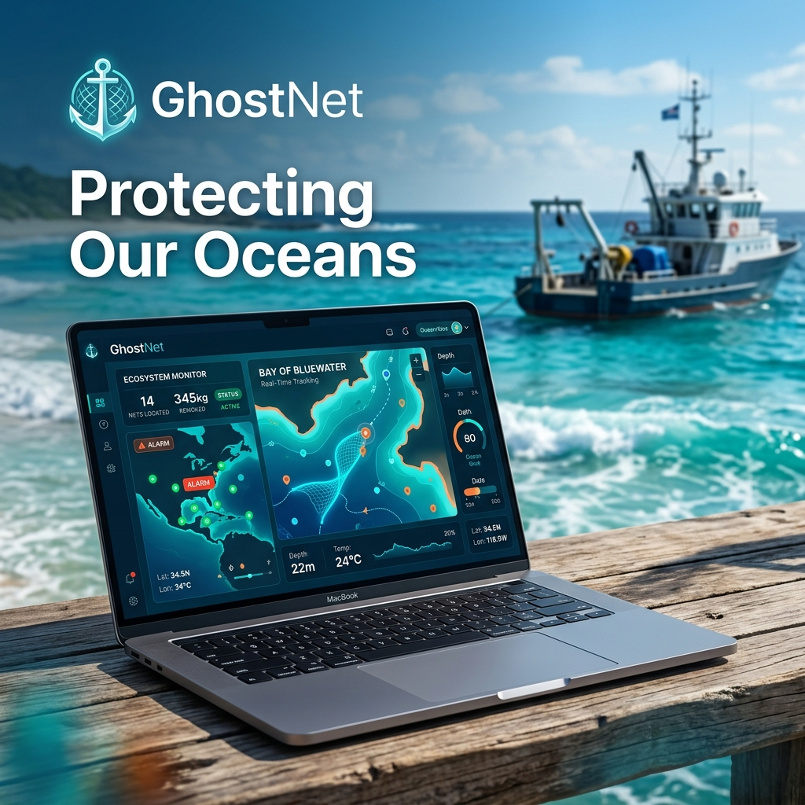

# 🌊 GhostNet: Maritime Hazard & Retrieval Platform

**GhostNet** is a high-performance, real-time maritime platform designed to protect our oceans by tracking, reporting, and facilitating the retrieval of abandoned "ghost nets." Built for both the local fishing community and specialized recovery teams, it combines mission-critical data with a premium, mobile-first experience.



## 🚀 Key Features

*   **📍 Real-Time Hazard Reporting**: Guardian users can instantly report lost nets with automated maritime zone detection and high-precision GPS tagging.
*   **⚓ Specialized Retrieval Missions**: Dedicated interface for recovery specialists with live navigation, nautical distance calculations (NM), and bearing indicators.
*   **📸 Evidence-Based Verification**: Integrated camera capture for "Proof of Retrieval," cryptographically linked to the specialist's identity and GPS proximity.
*   **🌐 Global Accessibility**: Full multi-language support in **English, Malayalam (മലയാളം), Tamil (தமிழ்),** and **Hindi (हिंदी)** for local maritime operations.
*   **📜 Automated Certification**: Generates a "Certificate of Recovery" for every successful mission, including GPS logs, image verification, and digital signatures.
*   **🔔 Tactical Dashboard**: Real-time hazard broadcasting via Supabase, notifying nearby vessels and teams of new maritime hazards instantly.

## 🛠️ Technical Stack

*   **Framework**: [Next.js 15+](https://nextjs.org/) (App Router & Turbopack)
*   **Styling**: [Tailwind CSS](https://tailwindcss.com/) & [Framer Motion](https://www.framer.com/motion/) for premium glassmorphism UI.
*   **Backend**: [Supabase](https://supabase.com/) (Auth, PostgreSQL, Real-time Broadcast, & Storage).
*   **Icons**: [Lucide React](https://lucide.dev/).
*   **Geospatial**: Web Geolocation API with Haversine formula for nautical navigation.

## 📦 Getting Started

### Prerequisites
*   Node.js 18+
*   Supabase Account

### Installation

1. Clone the repository:
   ```bash
   git clone https://github.com/mujthabasalim/ghostnet.git
   ```

2. Install dependencies:
   ```bash
   cd ghostnet/frontend
   npm install
   ```

3. Configure Environment Variables:
   Create a `.env` file in the `frontend` directory:
   ```env
   NEXT_PUBLIC_SUPABASE_URL=your_supabase_url
   NEXT_PUBLIC_SUPABASE_ANON_KEY=your_supabase_anon_key
   ```

4. Run Development Server:
   ```bash
   npm run dev
   ```

## 🗺️ System Architecture

*   **/app**: Next.js App Router for all platform routes.
*   **/components**: Atomic UI components, maps, and reporting forms.
*   **/context**: Global state management for Localization and Authentication.
*   **/lib**: Utility functions for maritime calculations and Supabase integration.

## 🛡️ Security & Integrity

GhostNet enforces **Spatial Integrity**. Hazard reporting and mission completion are restricted based on real-time GPS proximity and hardware camera verification to ensure data accuracy in professional maritime environments.

---

*Developed with ❤️ for the Ocean 🌊*
